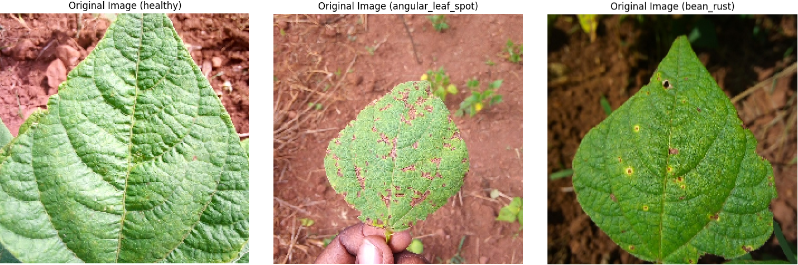
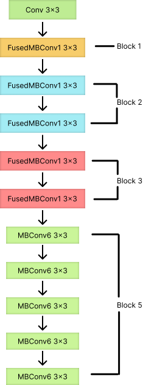
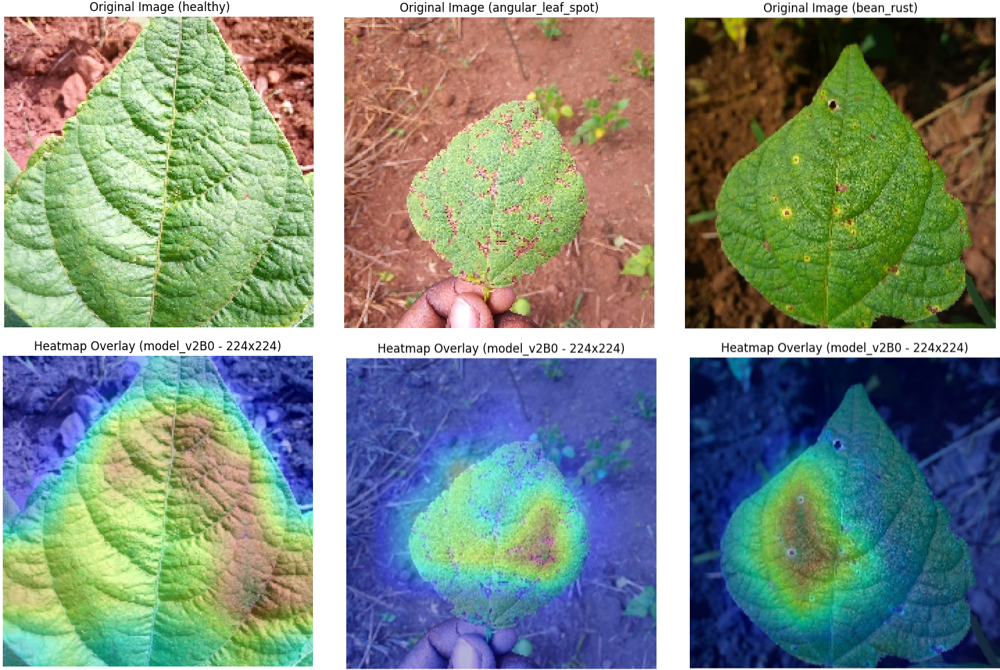

# TelU-Tubes-ProjectAkhir-BeanLeaf

## Deskripsi Proyek
Proyek ini bertujuan untuk mengklasifikasikan penyakit pada daun kacang dengan menggunakan arsitektur **Modified EfficientNetV2** yang dioptimalkan untuk perangkat terbatas sumber daya menggunakan TensorFlow Lite. Penyakit yang diklasifikasikan meliputi:
- **Healthy** (Daun Sehat)
- **Angular Leaf Spot**
- **Bean Rust**

Dengan model yang ringan, efisien, dan akurat, proyek ini bertujuan untuk membantu petani dalam mendeteksi penyakit tanaman kacang secara real-time menggunakan perangkat bergerak. Proyek ini merupakan repository dari paper [Classification of Bean Leaf Lesions Using Modified EfficientNetV2 for Implementation in TensorFlow Lite](README/Classification_of_Bean_Leaf_Lesions_Using_Modified_EfficientNetV2_for_Implementation_in_TensorFlow_Lite.pdf) dan [Slide Presentasi](README/Slide_Presentasi.pdf)

## Fitur Utama
1. **Klasifikasi Akurat**: Menggunakan model **Modified EfficientNetV2** yang mencapai akurasi tinggi hingga 97.76% pada pengujian.
2. **Efisiensi Model**: Ukuran model dioptimalkan hingga 6.18 MB dengan waktu inferensi 0.0594 detik.
3. **Grad-CAM Visualization**: Memberikan interpretasi prediksi model dengan menyoroti area penting pada gambar daun.
4. **Optimasi TensorFlow Lite**: Memastikan model siap digunakan pada perangkat dengan sumber daya terbatas seperti smartphone.

## Dataset
Dataset berisi gambar daun kacang yang dikelompokkan ke dalam 3 kelas:
- **Healthy**: Daun tanpa penyakit.
- **Angular Leaf Spot**: Penyakit bercak daun berbentuk sudut.
- **Bean Rust**: Penyakit karat daun.

### Distribusi Dataset:
| Class               | Training | Validation | Testing |
|---------------------|----------|------------|---------|
| Healthy             | 307      | 34         | 44      |
| Angular Leaf Spot   | 311      | 34         | 44      |
| Bean Rust           | 314      | 34         | 45      |
| **Total**           | 932      | 102        | 133     |

Dataset diambil dari sumber [publik](https://www.kaggle.com/datasets/marquis03/bean-leaf-lesions-classification) dan dibagi menjadi tiga subset utama: training, validation, dan testing.

Preview Bean Leaf Lession Dataset


## Arsitektur Model


## Hasil Evaluasi
Hasil menunjukkan bahwa model **Modified EfficientNetV2** memberikan keseimbangan optimal antara akurasi dan efisiensi:

| Model              | Akurasi (%) | Ukuran Model (MB) | Waktu Inferensi (s) |
|--------------------|-------------|-------------------|---------------------|
| EfficientNetV2B0  | 97.76       | 6.18              | 0.0594              |
| EfficientNetV2B1  | 87.97       | 7.46              | 0.0517              |
| EfficientNetV2B2  | 89.47       | 8.57              | 0.0706              |

Visualisasi menggunakan **Grad-CAM** menunjukkan kemampuan model untuk fokus pada area penting di daun, seperti lesi atau perubahan warna.

Visualisasi Grad-CAM


## Cara Penggunaan
1. **Clone Repository**:
   ```bash
   git clone https://github.com/AbiyaMakruf/TelU-Tubes-ProjectAkhir-BeanLeaf.git
   cd TelU-Tubes-ProjectAkhir-BeanLeaf
   ```

2. **Instalasi Dependensi**:
   ```bash
   pip install -r utils/requirements.txt
   ```

3. **Latih Model**:
   ```bash
   notebook.ipynb
   ```

## Kontribusi
Kami menerima kontribusi! Untuk berkontribusi:
1. Fork repository ini.
2. Buat branch baru untuk fitur atau perbaikan.
3. Kirimkan pull request ke branch utama.


## Kontributor
Jika Anda memiliki pertanyaan, silakan hubungi:
- Muhammad Abiya Makruf, **Email**: [abiyamf@student.telkomuniversity.ac.id](mailto:abiyamf@student.telkomuniversity.ac.id)
- Falah Asyraf Darmawan Putra, **Email**: [falaaah@student.telkomuniversity.ac.id](mailto:falaaah@student.telkomuniversity.ac.id)
- Akif Rachmat Hidayah, **Email**: [akifrh@student.telkomuniversity.ac.id](mailto:akifrh@student.telkomuniversity.ac.id)

## Daftar Tautan
- [Paper](https://telkomuniversityofficial-my.sharepoint.com/:w:/g/personal/abiyamf_student_telkomuniversity_ac_id/EbFgVqXWhjlGo6da1umRhYQBaI1pSXzSuLAqGzlQ_tg-EA?e=HLtTds).
- [Dataset](https://www.kaggle.com/datasets/marquis03/bean-leaf-lesions-classification).
- [Figma](https://www.figma.com/design/wEbmJgXglaldizYTZvwcVd/ProjectAI?m=auto&t=BKVKvfXPTWlFHMbJ-1).
- [Reference List](https://drive.google.com/drive/folders/1diQ7FSwj_1QQJ_JdSTpvq51KutL-ikRu?usp=sharing).
- [Canva](https://www.canva.com/design/DAGaxIVB3-0/X5pKboYgR2aNv1w6uZnTJA/edit?utm_content=DAGaxIVB3-0&utm_campaign=designshare&utm_medium=link2&utm_source=sharebutton).
---

Terima kasih telah mengunjungi proyek ini! Semoga bermanfaat bagi Anda.
